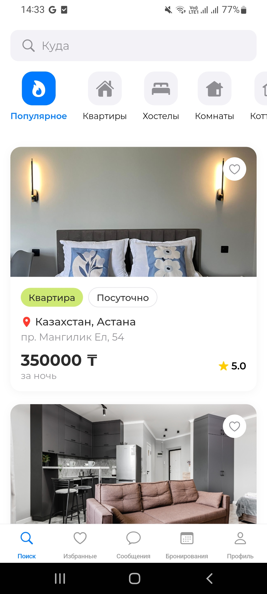
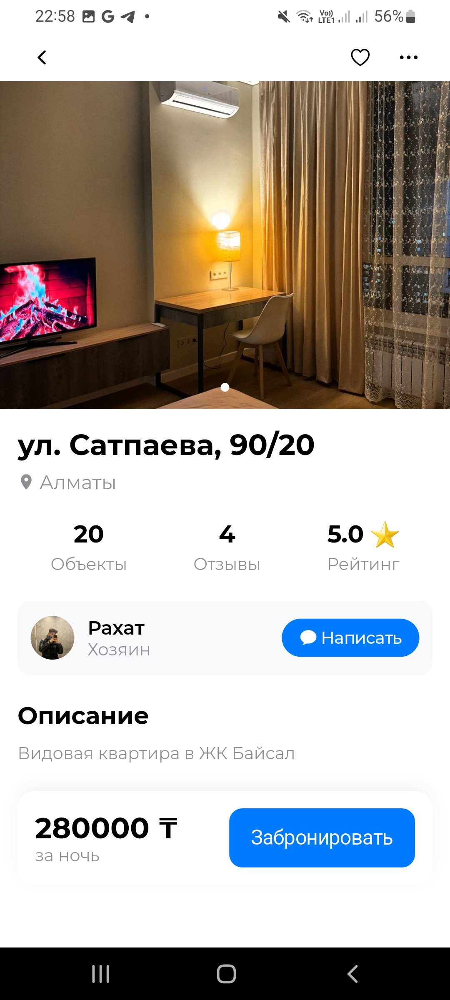
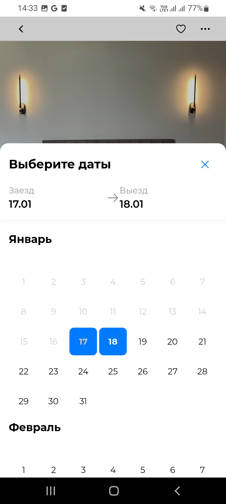
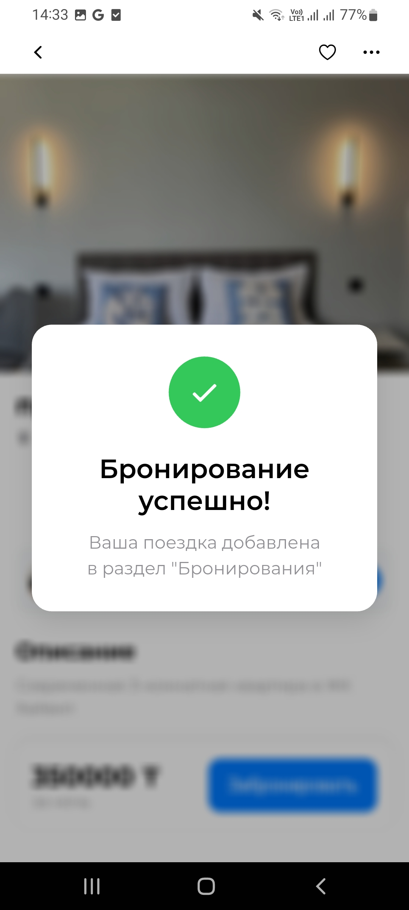
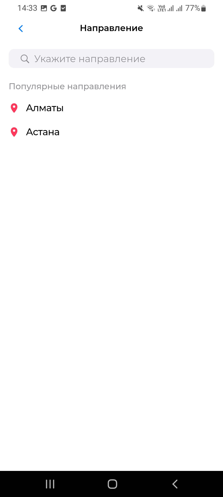

# AzaHomes🏠

A Flutter application for renting apartments in Astana and Almaty. It uses:
- Local DB (Hive)
- BLoC state management

## Features✨
- Browse apartments stored in a local Hive database.
- Filter and sort apartment listings using Flutter BLoC.
- Carousel of featured apartments.

## Getting Started 🚀
1. Clone the repository. 💻
2. Run flutter pub get to install dependencies. 📦
3. Run flutter pub run build_runner build to generate Hive adapters. 🛠️
4. Launch the app with flutter run. ▶️

Please include the following images in the app directory for it to run correctly:
owner1.png, owner2.jpg, owner3.jpg, owner4.jpg, owner5.jpg, owner6.jpg, owner7.jpg 🖼️

## Screenshots

## Project Structure
- `lib/` contains application code.
- `assets/` holds images and JSON data.
- `pubspec.yaml` defines dependencies, fonts, and assets.
- BLoC components are in `lib/bloc/`.

## Contributing
1. Fork the repository.
2. Create a new branch.
3. Commit changes.
4. Submit a pull request.
